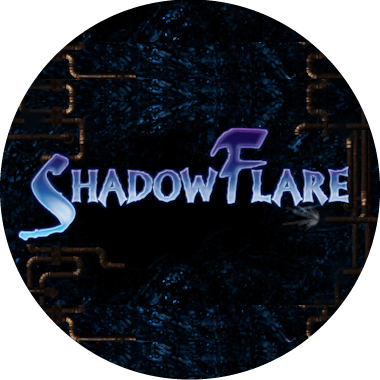

# OpenShadowFlare

OpenShadowFlare is a project aimed at reviving the classic game ShadowFlare by rewriting its core engine to make it compatible with modern systems and resolutions. The goal is to provide a way for both nostalgic gamers and new players to enjoy this beloved title without the limitations of outdated hardware and software.

## Table of Contents

- [Introduction](#introduction)
- [Features](#features)
- [Prebuilt Binaries](#prebuilt-binaries)
- [Building from source](#building-from-source)
- [Contributing](#contributing)
- [License](#license)

## Introduction

ShadowFlare, a unique episodic action RPG developed by Denyusha and presented by Emurasoft for Windows, comprises four distinct episodes. Its debut in Japan was in October 2001, and by October 2002, it had reached audiences worldwide. The story unfolded through releases between December 2002 and February 2003. Starting January 21, 2003, the game adopted a shareware approach, making the inaugural episode free for download. However, with the official website going offline in October 2013, it has become impossible to procure a legal copy of the game. Even though the site was revived in 2020, acquiring the game legally remains out of reach.

With technological progression, the classic game faces compatibility issues on contemporary systems. It's restricted to a 640 by 480 resolution and is exclusively designed for Windows. OpenShadowFlare seeks to rectify these limitations by revamping the game engine. Our goal is to support modern widescreen resolutions and expand its accessibility across various platforms, all while maintaining the essence of the original gameplay experience.

## Features

- **Contemporary System Support:** OpenShadowFlare adapts the beloved ShadowFlare to function seamlessly on modern-day systems, eliminating compatibility hitches.

- **Resolution Upgrade:** While maintaining the original game's distinctive art style, OpenShadowFlare restructures the engine to accommodate modern widescreen resolutions.

- **Optimized Performance:** The project seeks to refine the game's engine, ensuring a fluid and consistent gaming experience across platforms.

- **Bug Rectifications:** OpenShadowFlare is dedicated to ironing out glitches and issues that existed in the classic version, paving the way for a refined and enjoyable gameplay journey.

## Prebuilt Binaries

TODO: We offer pre-constructed binaries tailored for both Windows Linux and Mac.

## Building from Source

### Building for Windows
Opt for `msys2` and `build.sh`.

### Building for Linux/Mac
Simply utilize `build.sh`.

### Building on all Platforms
`cmake` is universally compatible.

### Incorporating Build Artifacts

Post-compilation, shift the generated artifacts, such as the DLL files, to the ShadowFlare game folder. But ensure to prefix the original game's DLLs with "o_", safeguarding them from being overwritten.

## Contributing

Contributions are welcome and greatly appreciated! If you're interested in contributing to OpenShadowFlare, please review our [Contribution Guidelines](readme/CONTRIBUTING.md) for details on how to get involved.

## License

This project is licensed under the [MIT](LICENSE), which means you are free to use, modify, and distribute the project as long as you provide appropriate attribution and include the original license text.

---

_Disclaimer: OpenShadowFlare is an independent project and is not affiliated with or endorsed by the creators of the original ShadowFlare game._
